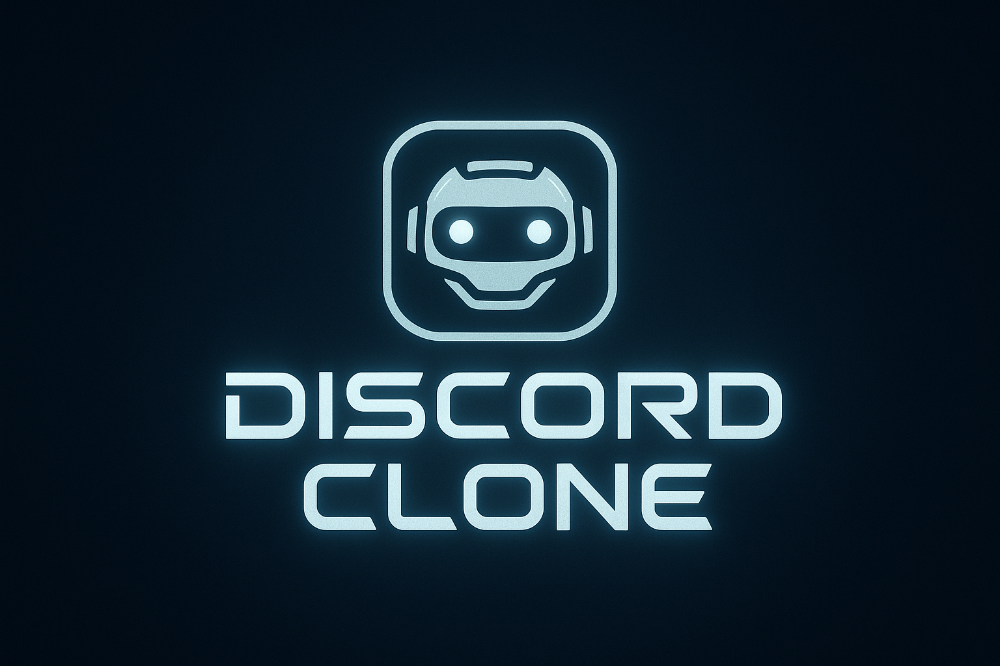
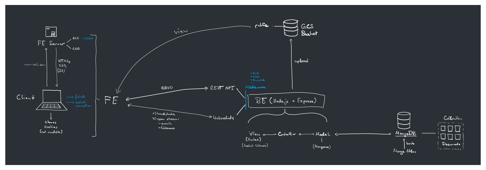
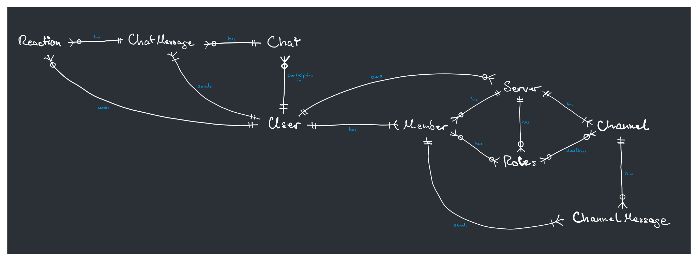
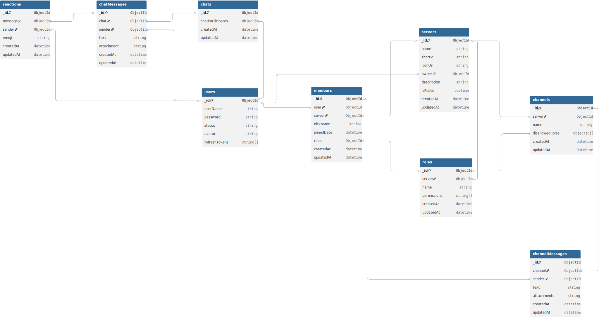
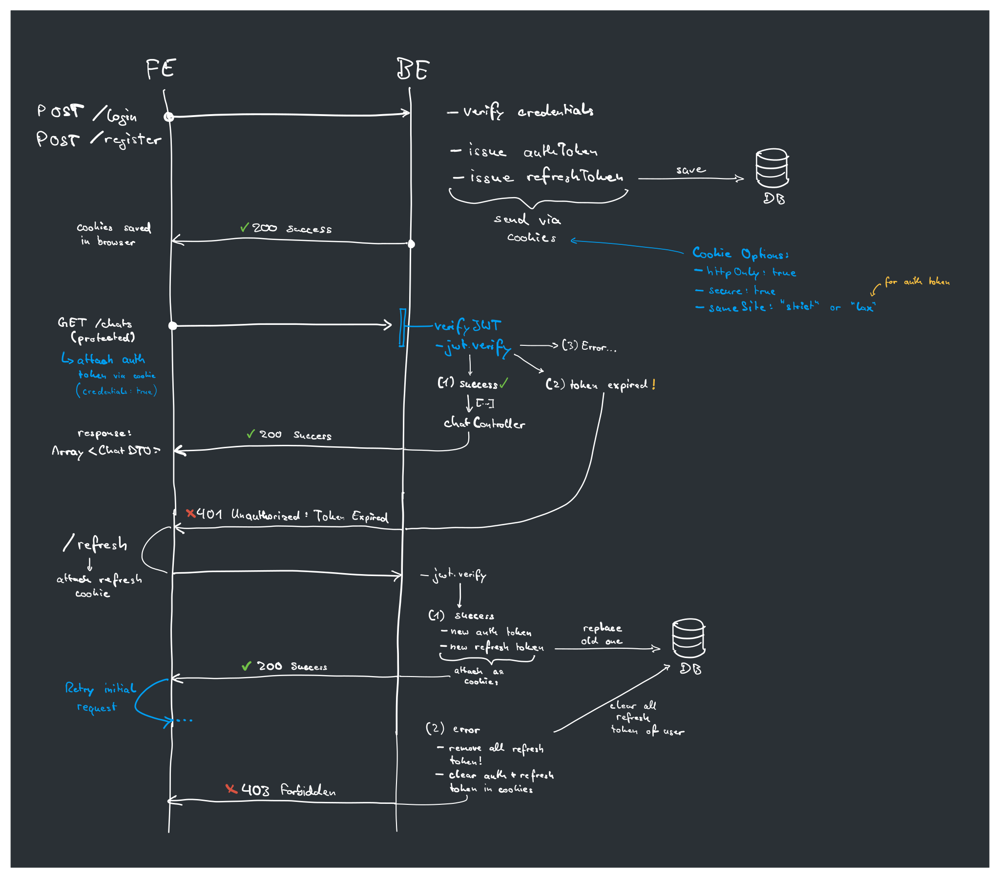

<div align="center"></div>

# Discord Clone Backend

A discord like app with servers, channels, role-management and DMs. See live version on https://discordclone.de

The frontend repository of this project can be found here.

## Features

Users can:

- Register and log-into accounts
- Customise their profile with status and profile image

- Create chats with other users
- Write messages within chats and send images

- Create and join servers
- Create channels within servers
- Create roles within servers that manage permissions for: manage roles, manage view channels, manage server (not fully implemented yet)
- Within channels, chat with other users
- Get realtime updates when server or channel settings change
- Can customise channel access based on roles (not implemented yet)

## Tech Stack

### Core Technologies

- Node.js
- Express.js
- MongoDB & Mongoose
- Socket.io (for managing real time chats)
- Vitest (for testing)

## Run Project Locally

### Prerequisites

- MongoDB: Install MongoDB locally on your machine either with [docker](https://hub.docker.com/_/mongo) (recommended) or [MongoDB Community Server](https://www.mongodb.com/try/download/community).
- GCS Emulator: Install fake-gcs-server on your machine with [docker](https://hub.docker.com/_/fsouza/fake-gcs-server)

To install MongoDB & the GCS Emulator, run the following command within this project:
```bash
docker compose up -d
```

### Environment Variables

For local development, create a `.env` file and copy the contents of the `.env.example` file into it.

### Installation

1. Clone the repository

```bash
git clone https://github.com/your-username/whatdidyougetdonetoday-ai.git
cd discord-clone-backend
```

2. Add environment variables

Create a `.env` file and copy the contents of the `.env.example` file into it.

1. Install dependencies

```bash
pnpm install
```

4. Start the development server

```bash
pnpm run dev
```

### Run Tests

```bash
pnpm run test
```

# Architecture

The following is a visual representation of the architecture of this full-stack web app, including frontend, backend, database and bucket:



# Database Design

The following is a logical model of the MongoDB database of this project:



The following is a physical model of the MongoDB database of this project:



# Auth and Refresh Flow

The following is a visual representation of the auth and refresh flow as implemented in this web app:




# Folder Structure

```
discord-clone-backend/
├── src/
│   ├── app.ts / server.ts        # Express + HTTP bootstrap
│   ├── sockets.ts                # Socket.IO initialization
│   ├── config/                   # env loading, database, storage, upload config
│   ├── controllers/              # Route handlers (auth, chats, servers, etc.)
│   ├── services/                 # Domain logic (auth, chat, server, storage)
│   ├── middleware/               # Express middlewares (JWT, errors, credentials)
│   ├── models/                   # Mongoose schemas
│   ├── routes/                   # Express routers + tests
│   ├── socketHandlers/           # Namespaced socket event controllers
│   ├── utils/                    # Cross-cutting helpers, DTO builders, validators
│   ├── types/                    # Shared TypeScript interfaces and socket types
│   └── __tests__/                # Vitest suites (mirrors runtime structure)
├── public/                       # Static assets served alongside the API
├── assets/                       # Documentation diagrams & images
├── docker-compose.yml            # Local MongoDB + fake GCS setup
└── etc / implementation-plans    # Threat models, design docs, planning notes
```

# API Endpoints

All endpoints respond with JSON unless noted and, unless marked Public, require a valid access token (httpOnly cookie or `Authorization: Bearer` header set by `verifyJWT`).

| Method | Path | Auth | Description |
| --- | --- | --- | --- |
| GET | `/` | Public | Basic health check to verify the API is reachable. |
| POST | `/register` | Public | Creates a new user, hashes the password, and issues login/refresh cookies. |
| POST | `/login` | Public | Verifies credentials and issues access + refresh cookies. |
| GET | `/refresh` | Refresh cookie | Exchanges a valid refresh token cookie for a new access token. |
| POST | `/logout` | Refresh cookie | Clears cookies and invalidates the stored refresh token. |
| GET | `/me` | JWT | Returns the authenticated user id, username, and avatar preview. |
| GET | `/profile` | JWT | Fetches the user's status and avatar metadata. |
| PUT | `/profile` | JWT | Updates the status message (validated to 200 chars). |
| PUT | `/profile/avatar` | JWT + multipart | Uploads a new avatar (`profilePicture` field, size/type checked) and replaces the previous file in GCS. |
| DELETE | `/profile/avatar` | JWT | Removes the stored avatar and deletes the object from storage. |
| GET | `/chat` | JWT | Lists every DM the user is part of, including last message metadata. |
| POST | `/chat` | JWT | Creates (or reuses) a private chat with `participant` username in the body. |
| DELETE | `/chat/:chatId` | JWT | Deletes a DM once both participants no longer need it. |
| POST | `/messages/attachment` | JWT + multipart | Creates a message with an uploaded `attachment` file and optional `text`, storing metadata + download URL. |
| DELETE | `/messages/attachment` | JWT | Removes an attachment by `messageId` and `attachmentPath`, deleting the object if needed. |
| POST | `/server` | JWT | Creates a new server, generates a 6-char shortId, and seeds membership. |
| PUT | `/server/:id` | JWT | Updates name/description/privacy when the user owns the server or has `ServerAdmin`. |
| DELETE | `/server/:id` | JWT | Deletes a server plus related channels, roles, and members (owner only). |
| GET | `/server/public` | JWT | Returns all public servers as lightweight cards for discovery. |
| GET | `/server/joined` | JWT | Lists servers the user is already a member of. |
| GET | `/server/:shortId` | JWT | Loads a full server snapshot (channels, roles filtered by permissions, member list). |
| POST | `/server/:shortId/join` | JWT | Joins a server by invite shortId (public servers or existing members). |
| POST | `/channel/:serverId` | JWT | Creates a text channel within a server (owner only for now). |
| PUT | `/channel/:serverId/:channelId` | JWT | Renames/reorders an existing channel owned by the server. |
| DELETE | `/channel/:serverId/:channelId` | JWT | Deletes a channel and notifies every subscriber in that server. |

# Socket Events

Every Socket.IO connection is wrapped by `verifySocketJWT`, so the client must provide a valid access token in the handshake (`auth.token`). Events that support acknowledgements return `{ status: 'OK', data: ... }` on success or an `EVENT_ERROR` instance on failure.

## Client → Server

| Event | Payload | Ack / Effect |
| --- | --- | --- |
| `chat:join` | `chatId` (string) | Joins the chat room, returns participant metadata plus the ordered message history. |
| `chat:leave` | `chatId` (string) | Leaves the chat room; no ack body. |
| `message:send` | `{ chatId, text }` | Persists a DM, broadcasts `message:new` to the room, ack includes the DTO. |
| `server:subscribe` | `serverId` (MongoId) | Validates membership, joins `server:${id}` room, ack returns the full `ServerDTO` (channels filtered by permissions). |
| `server:unsubscribe` | `serverId` | Leaves the server room; silent failure is logged server-side. |
| `channelMessages:subscribe` | `channelId` | Validates channel access, joins `channelMessages:${id}`, ack returns channel info + last 50 messages. |
| `channelMessages:unsubscribe` | `channelId` | Leaves the channel-messages room; ack confirms `{ success: true }`. |
| `channelMessage:new` | `{ channelId, text }` | Persists a guild-channel message, broadcasts `channelMessage:new`, ack carries the created DTO. |

## Server → Client

| Event | Emitted When | Payload |
| --- | --- | --- |
| `message:new` | DM created through sockets or the HTTP attachment endpoint | `{ message: MessageDTO }`. |
| `channelMessage:new` | Guild channel receives a text message | `ChannelMessageDTO`. |
| `server:updated` | Server metadata is edited via REST | `UpdatedServerDTO` with id, name, description, icon. |
| `server:deleted` | A server owner deletes the guild | Server id so subscribers can redirect. |
| `channel:created` / `channel:updated` / `channel:deleted` | Channel mutations via REST | For create/update: `ChannelDTO`; for delete: channel id. |


<hr />
<div align="center">
  <em>You've come to the end of this README. Thank you for reading <span style="color:#ff66a3;">&lt;3</span></em>
</div>
